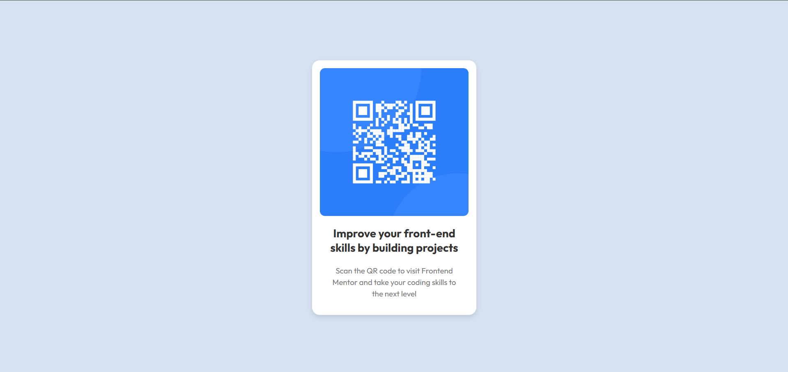

# Frontend Mentor - QR code component solution

This is a solution to the [QR code component challenge on Frontend Mentor](https://www.frontendmentor.io/challenges/qr-code-component-iux_sIO_H). Frontend Mentor challenges help you improve your coding skills by building realistic projects. 

## Table of contents

- [Overview](#overview)
  - [Screenshot](#screenshot)
  - [Links](#links)
- [My process](#my-process)
  - [Built with](#built-with)
- [Author](#author)

## Overview

### Screenshot

### Links

- Live Site URL: [https://robiulsagor.github.io/qr-code-design/](https://robiulsagor.github.io/qr-code-design/)

## My process

### Built with

- Semantic HTML5 markup
- CSS custom properties
- Flexbox
- Mobile-first workflow

## Author

- Website - [Robiul Islam Sagar](https://robiulportfolio.vercel.app/)
- Frontend Mentor - [@yourusername](https://www.frontendmentor.io/profile/yourusername)
- LinkedIn - [@Robiul Islam Sagar](https://www.linkedin.com/in/robiul-islam-sagar-356582226/)

**Note: Delete this note and add/remove/edit lines above based on what links you'd like to share.**
